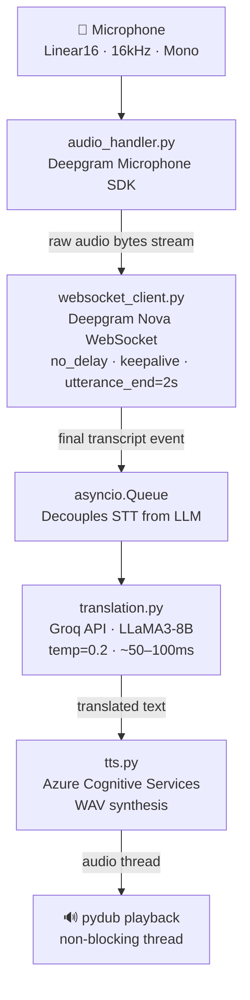

# Real-Time Multilingual Voice Translation Pipeline

> Sub-500ms end-to-end voice translation across 17 languages — Deepgram Nova · Groq LLaMA3 · Azure TTS


[](https://github.com/SrivalliAkoju24/real-time_speech_translation_bot/actions/workflows/ci.yml)

---

## What It Does

Captures live microphone input and delivers translated speech in under 500ms — end-to-end.

Spoken audio → **Deepgram Nova** (real-time STT) → **Groq + LLaMA3-8B** (translation) → **Azure TTS** (synthesized speech output). The entire pipeline is non-blocking: async event handlers, a transcription queue, and threaded audio playback ensure no stage waits on another.

---

## Architecture



---

## Performance

| Metric | Value |
|---|---|
| End-to-end latency | ~400–500ms |
| Deepgram Nova STT | ~150–200ms |
| Groq LLaMA3 translation | ~50–100ms |
| Azure TTS synthesis | ~150–200ms |
| Supported languages | 17 |
| Audio format | Linear16 PCM · 16kHz · Mono |

> Groq's Language Processing Unit (LPU) delivers 3–5× faster LLM inference than standard GPU APIs, making real-time translation viable at this latency budget.

---

## Tech Stack

| Component | Technology | Why This Choice |
|---|---|---|
| Speech-to-Text | **Deepgram Nova** | Lowest-latency streaming STT on the market; WebSocket-native with utterance detection |
| Translation | **Groq + LLaMA3-8B** | Sub-100ms LLM inference — Groq's LPU architecture is purpose-built for inference speed |
| Text-to-Speech | **Azure Cognitive Services** | High-quality neural voices in 17+ languages with reliable synthesis |
| Runtime | **Python asyncio** | Non-blocking pipeline; all I/O runs concurrently without threads blocking the event loop |
| Deployment | **GCP Cloud Run** | Serverless container scaling; no idle cost; matches Deepgram's low-latency SLA |

---

## Supported Languages

| # | Language | Code |
|---|---|---|
| 1 | English | `en` |
| 2 | Hindi | `hi` |
| 3 | Spanish | `es` |
| 4 | French | `fr` |
| 5 | German | `de` |
| 6 | Portuguese | `pt` |
| 7 | Italian | `it` |
| 8 | Japanese | `ja` |
| 9 | Korean | `ko` |
| 10 | Chinese (Mandarin) | `zh` |
| 11 | Arabic | `ar` |
| 12 | Russian | `ru` |
| 13 | Turkish | `tr` |
| 14 | Dutch | `nl` |
| 15 | Polish | `pl` |
| 16 | Bengali | `bn` |
| 17 | Urdu | `ur` |

Set `SOURCE_LANGUAGE` and `TARGET_LANGUAGE` in your `.env` to switch language pairs at runtime.

---

## Quick Start

### Prerequisites

- Python 3.11+
- A working microphone
- API keys for Deepgram, Groq, and Azure Cognitive Services (all have free tiers)

### 1. Clone and install

```bash
git clone https://github.com/SrivalliAkoju24/real-time_speech_translation_bot.git
cd real-time_speech_translation_bot
pip install -r requirements.txt
```

### 2. Configure credentials

```bash
cp .env.example .env
# Edit .env with your API keys
```

### 3. Run

```bash
python main.py
```

Start speaking. Translated audio plays automatically. Press `Ctrl+C` to stop (graceful shutdown — no stream corruption).

---

## Project Structure

```
real-time_speech_translation_bot/
├── main.py              # Async orchestrator — event loop, queue, shutdown
├── audio_handler.py     # Microphone capture via Deepgram Microphone SDK
├── websocket_client.py  # Deepgram WebSocket connection manager
├── translation.py       # Groq LLaMA3 translation (sync + async wrappers)
├── tts.py               # Azure Cognitive Services TTS + pydub playback
├── config.py            # Centralised config — all settings from .env
├── requirements.txt     # Pinned dependencies
├── .env.example         # Environment variable template
├── Dockerfile           # Container image for GCP Cloud Run
├── cloudbuild.yaml      # GCP Cloud Build CI/CD pipeline
└── tests/
    └── test_smoke.py    # Import + config structure smoke tests
```

---

## Deployment — GCP Cloud Run

```bash
# Authenticate
gcloud auth login
gcloud config set project YOUR_PROJECT_ID

# Build and deploy (single command)
gcloud builds submit --config cloudbuild.yaml \
  --substitutions=_SERVICE_NAME=speech-translation-bot,_REGION=us-central1 .
```

Set your API keys as Cloud Run environment variables or Secret Manager secrets — never bake them into the image.

---

## Key Design Decisions

**Why Groq over OpenAI for translation?**
Groq's LPU achieves ~50–100ms for LLaMA3-8B completions. GPT-3.5 averages 300–600ms. At real-time voice speeds, that 200–400ms difference is the difference between feeling instant and feeling laggy.

**Why `utterance_end_ms=2000` and `endpointing=1000`?**
Default Deepgram settings finalise too aggressively, cutting off sentences mid-thought. Tuning to 2s/1s absorbs natural speech pauses without adding perceivable delay.

**Why threaded TTS playback?**
Azure TTS synthesis is blocking. Running it in a `threading.Thread` prevents the audio playback from stalling the translation queue — next utterances keep processing while the current one plays.

**Why `asyncio.Queue` between STT and LLM?**
Decouples the Deepgram event callback (which must return fast) from the Groq API call (which takes ~100ms). The queue absorbs bursts of rapid speech without dropping transcriptions.

---

## Environment Variables

| Variable | Required | Default | Description |
|---|---|---|---|
| `DEEPGRAM_API_KEY` | ✅ | — | Deepgram API key |
| `GROQ_API_KEY` | ✅ | — | Groq API key |
| `AZURE_TTS_KEY` | ✅ | — | Azure Cognitive Services subscription key |
| `AZURE_REGION` | ✅ | `eastus` | Azure resource region |
| `SOURCE_LANGUAGE` | ❌ | `en-US` | Input language (BCP-47) |
| `TARGET_LANGUAGE` | ❌ | `hi` | Output language |

---

## License

MIT
